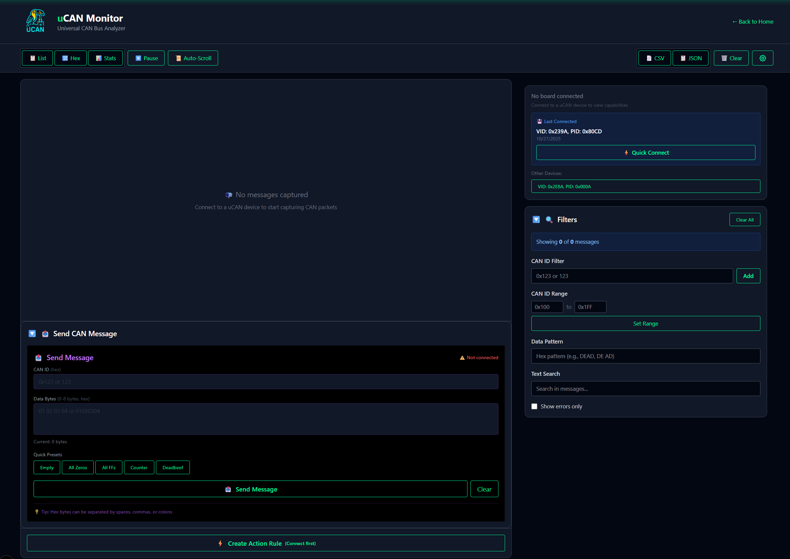
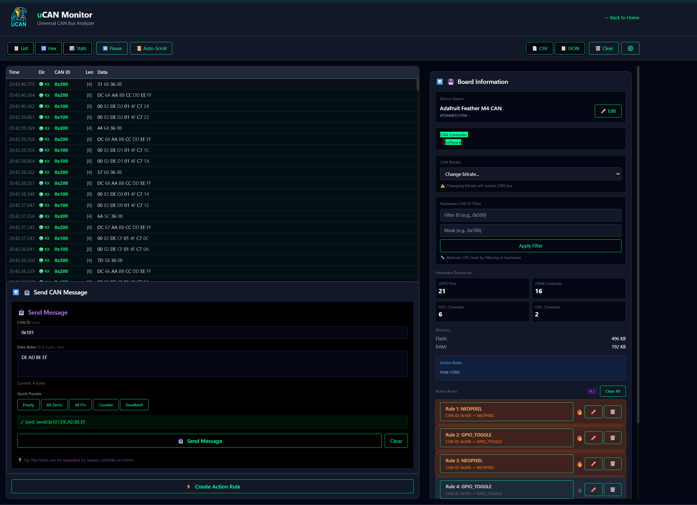
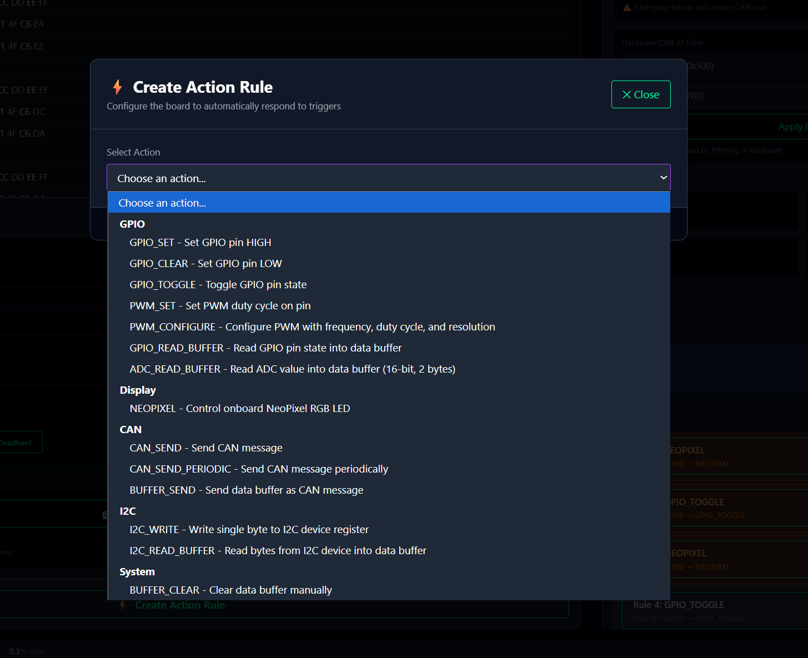

# uCAN - Universal USB-to-CAN Bridge

**Multi-platform CAN bus interface with web-based visualization and embedded firmware for RP2040, SAMD51, ESP32, and STM32 microcontrollers.**


---

## 🌐 Web Interface

**Live Demo**: [https://battlewithbytes.io/tools/ucan](https://battlewithbytes.io/tools/ucan)

The uCAN Web UI provides a modern, browser-based interface for monitoring and controlling CAN bus traffic in real-time. No installation required - just connect your uCAN device and open your browser.

### Screenshots

**Initial Connection Screen:**



**Live CAN Monitoring:**



**Rule-Based Action Configuration:**



### Web UI Features
- **Real-time CAN Message Monitoring** - Live visualization of CAN_RX/CAN_TX messages
- **Interactive Message Sending** - Send CAN messages with hex data input and validation
- **Rule-Based Actions** - Configure GPIO, PWM, NeoPixel actions triggered by CAN messages
- **Device Capability Discovery** - Automatic detection of board features and supported actions
- **Statistics Dashboard** - Message rates, error counts, bus load monitoring
- **Export & Recording** - Save CAN logs as CSV or JSON
- **Custom Visualizations** - Extensible widget system for CAN ID-specific displays
- **Zero Installation** - Works directly in modern browsers (Chrome, Firefox, Edge, Safari)

---

## ✨ Features

### 🔧 Multi-Platform Embedded Firmware
- **Hardware Abstraction Layer (HAL)** - Write once, run on any platform
- **RP2040 Support** - Raspberry Pi Pico with external MCP2551 CAN transceiver
- **SAMD51 Support** - Adafruit Feather M4 CAN with integrated CAN peripheral
- **ESP32/STM32 Ready** - HAL prepared for future platform additions
- **Unified Protocol v2.0** - Text-based serial protocol (115200 baud default)
- **Dynamic Capability Discovery** - Runtime query of board features and actions
- **Rule-Based Action System** - Hardware responses to CAN messages without host intervention
- **Data Pattern Matching** - Filter CAN messages by ID, mask, and data content
- **Periodic Transmission** - Configurable periodic CAN message sending
- **NeoPixel Visual Feedback** - Status indication on supported boards
- **Loopback Mode** - Built-in testing without external CAN devices

---

## 🚀 Quick Start

### 1. Choose Your Hardware

| Board | MCU | CAN Controller | Status | Notes |
|-------|-----|----------------|--------|-------|
| **Raspberry Pi Pico + MCP2551** | RP2040 | External SPI | ✅ Tested | Software CAN via PIO |
| **Adafruit Feather M4 CAN** | SAMD51 | Built-in MCAN | ✅ Tested | Integrated transceiver + NeoPixel |
| **ESP32 + SN65HVD230** | ESP32 | External | 🚧 HAL Ready | Implementation needed |
| **STM32F4 Nucleo** | STM32F4 | Built-in bxCAN | 🚧 HAL Ready | Implementation needed |

### 2. Install Firmware

#### **Option A: Use Pre-Built Firmware** (Easiest - Recommended)

**Download the latest release:**
1. Go to [GitHub Releases](https://github.com/ril3y/uCAN/releases)
2. Download the UF2 file for your board:
   - `uCAN-feather_m4_can-*.uf2` - Feather M4 CAN (500kbps default)
   - `uCAN-feather_m4_can_250k-*.uf2` - Feather M4 CAN (250kbps)
   - `uCAN-feather_m4_can_1m-*.uf2` - Feather M4 CAN (1Mbps)
   - `uCAN-pico-*.uf2` - Raspberry Pi Pico

**Install on Adafruit Feather M4 CAN:**
1. Double-click the **RESET** button on the board
   - The board enters bootloader mode
   - A drive named **FEATHERBOOT** appears
2. Drag and drop the `.uf2` file onto the FEATHERBOOT drive
3. The board automatically reboots with new firmware
4. A green NeoPixel blink confirms successful boot

**Install on Raspberry Pi Pico:**
1. Hold the **BOOTSEL** button while plugging in USB
2. A drive named **RPI-RP2** appears
3. Drag and drop the `.uf2` file onto the RPI-RP2 drive
4. The board automatically reboots with new firmware

**No tools or compilation required!**

---

#### **Option B: Build from Source** (For Developers)

**For Adafruit Feather M4 CAN:**

```bash
# Install PlatformIO
pip install platformio

# Build firmware (default 500kbps CAN)
pio run -e feather_m4_can

# Flash via USB
pio run -e feather_m4_can --target upload

# Monitor serial output
pio device monitor -b 115200
```

**Build Variants Available:**
```bash
# Debug build with verbose output
pio run -e feather_m4_can_debug --target upload

# Different CAN bitrates
pio run -e feather_m4_can_250k --target upload  # 250kbps
pio run -e feather_m4_can_1m --target upload    # 1Mbps

# Disable NeoPixel for power savings
pio run -e feather_m4_can_no_neopixel --target upload
```

**Hardware Connections:**
- Connect CANH/CANL to CAN bus
- Add 120Ω termination resistors at bus ends
- NeoPixel shows status: Green=TX, Yellow=RX, Red=Error

#### **For Raspberry Pi Pico** (RP2040)

```bash
# Build firmware
pio run -e pico

# Flash firmware (put Pico in BOOTSEL mode)
pio run -e pico --target upload

# Or manually: Copy .pio/build/pico/firmware.uf2 to RPI-RP2 drive
```

**Hardware Connections:**
```
Pico GP4 (CAN TX) → MCP2551 TXD
Pico GP5 (CAN RX) → MCP2551 RXD
Pico 3.3V → MCP2551 VCC
Pico GND → MCP2551 GND
MCP2551 CANH/CANL → CAN Bus (with 120Ω termination)
```

### 3. Use the Web Interface

1. **Connect device** - Plug uCAN board into USB port
2. **Open browser** - Navigate to [https://battlewithbytes.io/tools/ucan](https://battlewithbytes.io/tools/ucan)
3. **Click "Connect"** - Select your uCAN device from the Web Serial dialog
4. **Start monitoring** - CAN messages appear in real-time!

---

## 📡 Protocol v2.0

uCAN uses a human-readable text protocol over USB serial (115200 baud). All communication is line-oriented (newline-terminated) with semicolon-delimited fields.

### Example Messages

**Device → Host:**
```
CAN_RX;0x123;01,02,03,04;1234567890
CAN_TX;0x456;AA,BB,CC,DD;1234567891
STATUS;CONNECTED;uCAN v2.0.0 Ready
CAPS;{"board":"Feather M4 CAN","chip":"ATSAME51","clock_mhz":120,...}
ACTION;1;GPIO_SET;0x100;OK
```

**Host → Device:**
```
send:0x123:01,02,03,04              # Send CAN message
config:mode:loopback                 # Enable loopback mode
get:capabilities                     # Query board capabilities
action:add:0:0x100:0xFFFFFFFF:::0:GPIO_SET:fixed:13  # Add action rule
action:list                          # List active rules
```

**Full Specification**: [docs/PROTOCOL.md](docs/PROTOCOL.md)

---

## 🎯 Action System

uCAN's rule-based action system allows CAN messages to trigger hardware responses automatically, without host intervention. Perfect for embedded control applications!

### Supported Actions

| Action | Description | Parameters | Platforms |
|--------|-------------|------------|-----------|
| `GPIO_SET` | Set pin HIGH | pin (0-53) | All |
| `GPIO_CLEAR` | Set pin LOW | pin (0-53) | All |
| `GPIO_TOGGLE` | Toggle pin state | pin (0-53) | All |
| `PWM_SET` | Set PWM duty cycle | pin, duty (0-255) | SAMD51, ESP32 |
| `NEOPIXEL_COLOR` | Set RGB color | r, g, b, brightness | SAMD51 |
| `CAN_SEND` | Send CAN message | can_id, data bytes | All |
| `CAN_SEND_PERIODIC` | Periodic CAN send | can_id, data, interval_ms | All |
| `ADC_READ_BUFFER` | Read ADC to buffer | pin, slot | All with ADC |
| `I2C_WRITE` | Write I2C device | address, register, value | All with I2C |
| `I2C_READ_BUFFER` | Read I2C to buffer | address, register, count, slot | All with I2C |

### Action Rule Format

```
action:add:{id}:{can_id}:{can_mask}:{data}:{data_mask}:{data_len}:{action}:{param_source}:{params...}
```

**Fields:**
- `id`: Rule ID (0 = auto-assign)
- `can_id`: CAN ID to match (hex, e.g., 0x100)
- `can_mask`: CAN ID mask (0xFFFFFFFF = exact match, 0x000 = match any)
- `data`: Data pattern to match (comma-separated hex bytes, e.g., FF,00)
- `data_mask`: Data mask (FF = must match, 00 = don't care)
- `data_len`: Required data length (0 = any length)
- `action`: Action type (see table above)
- `param_source`: `fixed` (rule parameters) or `candata` (extract from CAN message)
- `params`: Action-specific parameters

### Examples

```bash
# Toggle LED on pin 13 whenever CAN ID 0x100 is received
action:add:0:0x100:0xFFFFFFFF:::0:GPIO_TOGGLE:fixed:13

# Set NeoPixel to red when CAN ID 0x500 received
action:add:0:0x500:0xFFFFFFFF:::0:NEOPIXEL_COLOR:fixed:255:0:0:200

# Send heartbeat every 1000ms
action:add:0:0x000:0x00000000:::0:CAN_SEND_PERIODIC:fixed:0x123:01,02,03,04:1000

# GPIO pin 14 HIGH only when CAN ID 0x200 has first byte = 0xFF
action:add:0:0x200:0xFFFFFFFF:FF:FF:1:GPIO_SET:fixed:14

# Extract RGB from CAN data bytes [0,1,2] and set NeoPixel
action:add:0:0x500:0xFFFFFFFF:::0:NEOPIXEL_COLOR:candata

# List all active rules
action:list

# Remove rule ID 2
action:remove:2

# Disable rule ID 1
action:disable:1
```

---

## 🛠️ Adding Support for New Boards

uCAN's Hardware Abstraction Layer makes it easy to add new platforms. Follow these steps:

### 1. Platform Detection

Add your platform to `src/hal/platform_config.h`:

```cpp
#elif defined(ARDUINO_ARCH_ESP32)
    #define PLATFORM_ESP32
    #define PLATFORM_NAME "ESP32"
```

### 2. Capability Definition

Create `src/capabilities/esp32_capabilities.cpp`:

```cpp
#include "board_capabilities.h"

#ifdef PLATFORM_ESP32

PlatformCapabilities platform_capabilities = {
    .board_name = "ESP32 DevKit",
    .chip_name = "ESP32",
    .flash_size = 4*1024*1024,  // 4MB
    .ram_size = 520*1024,        // 520KB
    .gpio_count = 34,
    .pwm_channels = 16,
    // ... etc
};

#endif
```

### 3. HAL Implementation

Create `src/hal/esp32_can.cpp`:

```cpp
#include "can_interface.h"

#ifdef PLATFORM_ESP32

class ESP32CAN : public CANInterface {
public:
    bool initialize(const CANConfig& config) override {
        // Initialize ESP32 CAN peripheral
        return true;
    }

    bool send_message(const CANMessage& message) override {
        // Transmit CAN message
        return true;
    }

    bool receive_message(CANMessage& message) override {
        // Receive CAN message
        return true;
    }

    // Implement other virtual methods...
};

#endif
```

### 4. Factory Registration

Add to `src/hal/can_factory.h`:

```cpp
#ifdef PLATFORM_ESP32
    return new ESP32CAN();
#endif
```

### 5. PlatformIO Environment

Add to `platformio.ini`:

```ini
[env:esp32]
platform = espressif32
board = esp32dev
framework = arduino
build_flags =
    -DPLATFORM_ESP32
    -DDEFAULT_CAN_BITRATE=500000
lib_deps =
    ESP32-CAN  # Your CAN library
```

### 6. Build & Test

```bash
pio run -e esp32
pio run -e esp32 --target upload
```

**That's it!** Your new board is now fully integrated with uCAN's protocol, action system, and web UI.

---

## 📁 Project Structure

```
uCAN/
├── src/                           # Embedded firmware (C++)
│   ├── hal/                       # Hardware Abstraction Layer
│   │   ├── can_interface.h        # Abstract CAN interface
│   │   ├── can_factory.h          # Platform-specific factory
│   │   ├── rp2040_can.cpp/.h      # RP2040 implementation
│   │   ├── samd51_can.cpp/.h      # SAMD51 implementation
│   │   └── platform_config.h      # Platform detection
│   ├── capabilities/              # Platform capability system
│   │   ├── board_capabilities.h   # Capability definitions
│   │   ├── capability_query.cpp   # JSON capability responses
│   │   ├── rp2040_capabilities.cpp
│   │   └── samd51_capabilities.cpp
│   ├── actions/                   # Rule-based action system
│   │   ├── action_types.h         # Action type definitions
│   │   ├── action_manager_base.h/.cpp  # Base action manager
│   │   ├── action_manager.h/.cpp  # Platform-specific managers
│   │   ├── param_mapping.h/.cpp   # CAN data parameter extraction
│   │   └── custom_command.h/.cpp  # Custom user commands
│   └── main.cpp                   # Main firmware entry point
│
├── tests/                         # Integration test suite
│   ├── conftest.py                # Pytest fixtures
│   ├── test_basic_commands.py     # Protocol command tests
│   ├── test_can_messaging.py      # CAN TX/RX tests
│   ├── test_rule_management.py    # Action system tests
│   └── test_*.py                  # Additional test modules
│
├── docs/                          # Documentation
│   ├── PROTOCOL.md                # Protocol v2.0 specification
│   ├── screenshots/               # Web UI screenshots
│   ├── PROTOCOL_COMPLIANCE_REVIEW.md  # Protocol analysis
│   └── UCAN_WEB_API_GUIDE.md      # Web developer guide
│
├── platformio.ini                 # PlatformIO build configuration
├── pyproject.toml                 # Python test package configuration
└── README.md                      # This file
```

---

## 🧪 Testing

uCAN includes a comprehensive integration test suite with **91 passing tests** covering protocol compliance, CAN messaging, action system, error handling, and GPIO/PWM/NeoPixel operations.

```bash
# Run all tests
python -m pytest tests/ --port COM3

# Run integration tests only (requires connected hardware)
python -m pytest tests/ -m integration --port COM3

# Run with verbose output
python -m pytest tests/ --port COM3 -v

# Run specific test file
python -m pytest tests/test_can_messaging.py --port COM3
```

**Test Markers:**
- `@pytest.mark.integration` - Tests using loopback mode (no external CAN devices)
- `@pytest.mark.hardware` - Tests requiring connected hardware
- `@pytest.mark.system` - Tests requiring physical CAN bus with devices

---

## 📚 Documentation

- **[Protocol v2.0 Specification](docs/PROTOCOL.md)** - Complete protocol reference
- **[Web API Guide](docs/UCAN_WEB_API_GUIDE.md)** - Web developer integration
- **[Protocol Compliance Review](PROTOCOL_COMPLIANCE_REVIEW.md)** - Implementation analysis
- **[Action System Architecture](ACTION_MANAGER_ARCHITECTURE.md)** - Action system design
- **[Parameter Mapping Design](DESIGN_ACTION_PARAMETER_MAPPING.md)** - CAN data extraction

---

## 🤝 Contributing

Contributions welcome! Areas for contribution:
- **ESP32 HAL Implementation** - Complete ESP32 support
- **STM32 HAL Implementation** - Complete STM32 support
- **Web UI Features** - Enhance browser-based interface
- **Documentation** - Improve guides and examples
- **Test Coverage** - Add integration tests
- **New Actions** - Implement additional hardware actions

See [docs/DEVELOPER.md](docs/DEVELOPER.md) for development guidelines.

---

## 📄 License

This project is licensed under the MIT License - see the [LICENSE](LICENSE) file for details.

---

## 🙏 Acknowledgments

- **[PlatformIO](https://platformio.org/)** - Embedded development platform
- **[can2040](https://github.com/KevinOConnor/can2040)** - RP2040 CAN library
- **[Adafruit CAN Fork](https://github.com/adafruit/Adafruit_CAN)** - SAMD51 CAN library
- **[Web Serial API](https://developer.mozilla.org/en-US/docs/Web/API/Web_Serial_API)** - Browser USB serial
- **[pytest](https://pytest.org/)** - Python testing framework

---

## 🔗 Links

- **Live Web UI**: [https://battlewithbytes.io/tools/ucan](https://battlewithbytes.io/tools/ucan)
- **GitHub Repository**: [https://github.com/ril3y/uCAN](https://github.com/ril3y/uCAN)
- **Issue Tracker**: [GitHub Issues](https://github.com/ril3y/uCAN/issues)
- **Protocol Documentation**: [docs/PROTOCOL.md](docs/PROTOCOL.md)

---

## 💬 Support

For questions, issues, or contributions:
1. **Check Documentation** - Review protocol spec and guides
2. **Search Issues** - Look for existing solutions
3. **Open Issue** - Describe problem with hardware details
4. **Pull Request** - Submit improvements with tests

---

**Made with ❤️ for the embedded and automotive development community**
